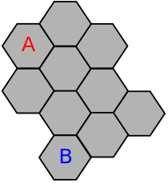

# Game Service

Responsible for handling all game requests.

## Game Overview 



## Development

First start a virtual environment. For example:

> python3.8 -m venv venv
> . venv/bin/activate

Install the dependencies with `make install`. 

### Docker

Because none of the services images have been uploaded to a cloud hosted
registry you will need to build the dependency images yourself before being
able to run this service. Run `make build` in each of the following
repositories:

- player-api
- board-api
- combat-api

Now run `make up`. You may have to wait until the MySQL instance comes up
before the other containers will stay alive. To check whether the MySQL
database has finished coming up, run `docker logs risk-db` and look for text
similar to `ready for connections. Version: '8.0.20'  socket:
'/var/run/mysqld/mysqld.sock'  port: 3306  MySQL Community Server - GPL.`. Once
the MySQL container has finished coming up run `make up` again. You can check
that all expected containers are up by running `docker ps`.

#### Important 

Remember to keep your local images up to date.

Soon images will be hosted so remembering to update images will no longer be an
issue.

### Database

To connect to the mysql database running in a the docker container run the
following command.


``` bash
mysql --host={HOST} --port={PORT} --protocol=TCP --user={USER} risk --password={PASSWORD}`
```
 
## Using the API 

### GET 

#### `/v0/attack/`

``` http 
    curl localhost:8000/v0/attack?attacker={"territory_id"}&defender={"territory_id"}
```

### POST 

#### `v0/randomly-assign-players

``` http
    curl -x POST localhost:8000/v0/randomly-assing-players -d '{"player1_id": 1, "player2_id": 2}'
```
